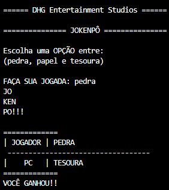

# jokenpo
Game jokenpo

Um jogo para jogar contra a máquina.

Todas as escolhas feitas pelo PC são aleatórias, o código sorteia 3 números fixos de forma aleatória(1, 2 e 3) e na continuidade das linhas eu atribui a cada número uma possível jogada(pedra, papel e tesoura)

#Tela inicial da programa

#Primeiro jogo realizado

#Segundo jogo realizado

#Terceiro jogo realizado
